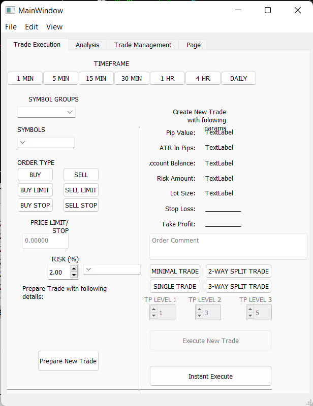

## Meta Trader 5 Trade Manager

The GUI application is intended to be used for facilitating trades in the MT5 platform. The application utilizes the Python API of the platform to carry out client requests. There will be need to expand functionality to include MQL4 & MQL5 scripts, as the API is still not mature enough.



---
## Expectations

Expected to grow with time, the main areas of current focus:

Risk Management - To provide risk calculation mechanisms for new trades. This is purely opinionated based on my own structure of placing trades with viable ris ranges. the application is due to take into consideration: a. % Balance of account to be risked during any trade b. Determine lot sizes to ensure balanced margin capacities for instruments with different risk thresholds c. Determine Stop Loss & Take Profit values based on the instrument's ATR value

Trade Placement, Updating, Deletion - In comparison to MT4's procedure of carrying out these tasks, it's intended that the application will allow for quicker manipulation once a solid workflow is developed.

Trade Performance Evaluation

Trade monitoring

You can use the [editor on GitHub](https://github.com/teddywaweru/FX_MT4_app/edit/gh-pages/index.md) to maintain and preview the content for your website in Markdown files.

Whenever you commit to this repository, GitHub Pages will run [Jekyll](https://jekyllrb.com/) to rebuild the pages in your site, from the content in your Markdown files.

### Markdown

Markdown is a lightweight and easy-to-use syntax for styling your writing. It includes conventions for

```markdown
Syntax highlighted code block

# Header 1
## Header 2
### Header 3

- Bulleted
- List

1. Numbered
2. List

**Bold** and _Italic_ and `Code` text

[Link](url) and 
```

For more details see [Basic writing and formatting syntax](https://docs.github.com/en/github/writing-on-github/getting-started-with-writing-and-formatting-on-github/basic-writing-and-formatting-syntax).

### Jekyll Themes

Your Pages site will use the layout and styles from the Jekyll theme you have selected in your [repository settings](https://github.com/teddywaweru/FX_MT4_app/settings/pages). The name of this theme is saved in the Jekyll `_config.yml` configuration file.

### Support or Contact

Having trouble with Pages? Check out our [documentation](https://docs.github.com/categories/github-pages-basics/) or [contact support](https://support.github.com/contact) and we’ll help you sort it out.
